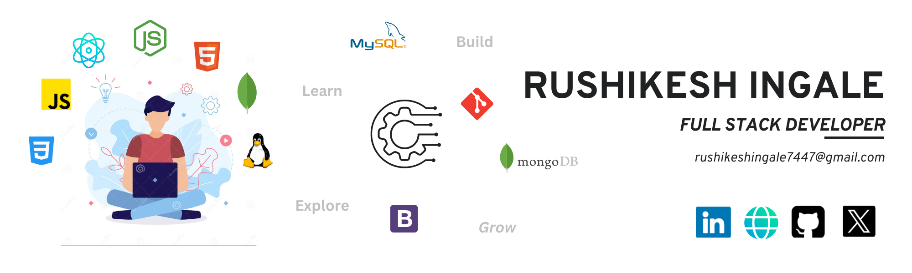

<h1 align="center" >Hi, I'm <a href="https://www.linkedin.com/in/rushikeshingale01/" target="_blank"> Rushikesh Ingale </a></h1>

Hello, my name is <b>Rushikesh Ingale</b>, and I am a passionate <b>Full Stack Developer</b>. I am enthusiastic about web development and eager to contribute to building complete and scalable applications.

My journey in the realm of technology began with my studies in <b>Computer Management in Cyber Commerce</b>. This educational background has provided me with a strong foundation in computer science principles and a keen understanding of cyber commerce, shaping my interest in web development.

In my journey as a front-end developer, I have focused on mastering HTML, CSS, and JavaScript frameworks such as React. I am passionate about crafting intuitive user interfaces that offer exceptional user experiences. I meticulously ensure that the websites or applications I work on are responsive, visually appealing, and accessible across various devices and browsers.

Transitioning to the back end, I learned server-side frameworks like Node.js. I delved into working with databases such as MySQL and MongoDB, where I designed efficient database structures and learned to write optimized queries. My goal was to become proficient in integrating RESTful APIs into applications to enable seamless communication between the front end and back end.

While I am relatively new to version control systems like Git, I am eager to learn and grow in this area. I am also keen on embracing collaborative environments using Agile methodologies. Staying updated with the latest trends and technologies in web development excites me, as it allows me to continually improve my skills and deliver innovative solutions. ⚡
<h3 align="center"> Paasionate Full Stack Developer </h3>
<h4 align="center"> Views </h4>
<h3>
  
</h3>
   

<h1>Technical Skills 🛠</h1>
 

 
    
    
    
    
    
    
    
    
    
    
    
    
    
    
    

I believe in implementing the knowledge which you have. Projects play a significant role in showcasing your skills. They help in predicting the skills of a person. So let's have a look at my project section.

<h1 align="center">Projects</h1>

| Project Name      | Description | 
| :---:        |    :----   |  
| [My Portfolio Website](https://mrrushikesh.github.io/Rushikesh_Ingale_Portfolio/)     | Portfolio website build using HTML5, CSS3, JavaScript and jQuery. |
| [Restaurant Reservation Website]()   | This is a Restaurant Reservation Website where you can keep a record of all the books you have issued.© 2022 Saurav Mukherjee| 
| [E-Commerce Website]()     | Classify emails as spam or not-spam on the basis of the message.|
| [To-Do-List]()     | Menses-Enables Menstrual Hygiene Solutions Tech Used: Google Maps API, Html5, bootstrap5, JavaScript SCSS, email.js, firebase, Firestore, and Alan AI. | 
| [Netflix-Clone-react-App]()     | Netflix clone App built with ReactJS, NextJS TMDB API, Firebase, CSS and JavaScript. |
| [Amazon Clone Marketplace]()     | Amazon clone e-commerce full stack web app built using ReactJS and NextJS. Tech Used: ReactJS, Webhooks, Stripe Payments API for Checkout, Cloud Firestore database, NextAuth, Redux, Google Authentication, Add to Basket Functionality, Tailwind CSS and Vercel. |

 <h1 align="center">Let's Get Connected</h1>

<a href="mailto:rushikeshingale7447@gmail.com">

<a  href="">

   
   

  
   
<table>
  <tr>
   
<td>
    <td></td>
  </tr>
</table>

  

   
   

<table>
   <tr>
      <td>
         <picture style="border: 2px solid #ffffff">
           <source 
             media="(prefers-color-scheme: dark)"
             srcset="https://raw.githubusercontent.com/MrRushikesh/snk/output/github-contribution-grid-snake-dark.svg"
           />
           <source
             media="(prefers-color-scheme: light)"
             srcset="https://raw.githubusercontent.com/MrRushikesh/snk/output/github-contribution-grid-snake.svg"
           />
           
         </picture>
      </td>
   </tr>
</table>
